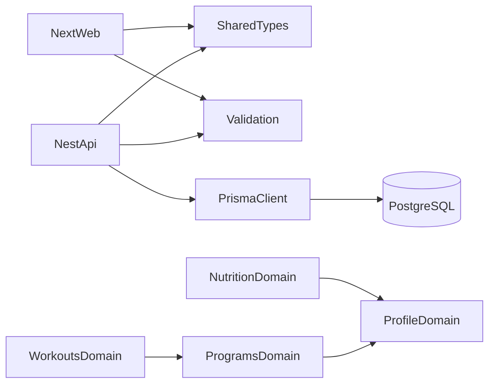

# Architecture

YS Fitness is a pnpm/Turborepo monorepo with a NestJS REST API, a Next.js web app, PostgreSQL through Prisma, and shared contract packages.

## Domain boundaries

Questionnaire input, derived targets, and generated plans are separate domain concerns:

- **Profile data** records facts supplied by the user: date of birth, calculation sex, height, activity level, goal, restrictions, and measurement history.
- **Nutrition** calculates and stores versioned calorie and macro targets from profile data. It must not add calculated values to `UserProfile`.
- **Programs** generates and assigns workout programs. Program state must not be embedded in profile or nutrition records.
- **Workouts** records performed sessions, sets, reps, and loads independently from program templates.

Web onboarding asks program track (female/male visual branch) once. That choice also fills `biologicalSexForCalculation` on the persisted profile. Program track itself stays in the browser draft until a programs contract exists. See [ADR 003](docs/adr/003-onboarding-program-track-and-bmr-sex.md).

A domain may read another domain through an explicit service or public contract. It must not mutate another domain's tables directly. New calculated outputs should retain enough input/version metadata to explain when and how they were produced.

## Backend modules

NestJS modules own their HTTP endpoints, domain logic, and data access. Controllers remain thin. Zod request schemas originate in `@repo/validation`; public response shapes originate in `@repo/shared-types`. Prisma-generated types stay inside `apps/api`.

Prisma access belongs in a domain service for simple modules or a repository when queries become nontrivial or need focused unit testing. Controllers never inject `PrismaService`.

See [CONTRIBUTING.md](CONTRIBUTING.md) for the standard module tree.

## Authentication sessions

Every login creates an `AuthSession`. Access JWTs contain only identity and authorization claims: `sub`, `sessionId`, `role`, `iat`, and `exp`.

Refresh JWTs are one-time credentials. The API stores only their SHA-256 digests in `AuthRefreshToken` records:

1. A valid refresh consumes the current token record.
2. A replacement token is issued in the same transaction.
3. Presenting a consumed token proves that a credential has been copied or replayed.
4. The whole session and its token family are revoked because the server cannot identify which holder is legitimate.

Password hashing uses Argon2. Refresh-token digests use SHA-256 because refresh tokens already have high cryptographic entropy and require indexed lookup.

Browser refresh tokens use HttpOnly cookies with origin checks and SameSite protection. `SameSite=None` additionally requires a signed double-submit CSRF token. Native clients receive refresh tokens in the response body for secure device storage.

Decision details are recorded in [ADR 001](docs/adr/001-refresh-token-rotation.md).

## Shared package boundaries

### `@repo/shared-types`

Contains public API request/response/error contracts used across applications. It must never export:

- Prisma models, generated enums, or `Prisma.Decimal`
- database-only fields such as password or token hashes
- internal persistence shapes

API services map persistence results into these contracts at the boundary.

### `@repo/validation`

Contains reusable Zod schemas and their inferred input types. The API uses them for runtime request validation; web/mobile use the same schemas for forms. Domain-only invariants that require database state remain in domain services.

Zod is the only request-validation strategy. Do not introduce `class-validator`. See [ADR 002](docs/adr/002-zod-validation.md).

### `@repo/ui`

Contains cross-application visual primitives only. Web-specific compositions remain in `apps/web`.

## Dependency direction

Shared packages do not depend on applications or Prisma. Domain modules do not import controllers from other domains.

## Subscriptions

The subscriptions module owns `plans` and `subscriptions`. Checkout talks to a `PAYMENT_PROVIDER` token; the current implementation is `MockPaymentProvider` (instant confirmation, no hosted page). Trainer/admin grants write `MANUAL` subscriptions and never call the provider. PostgreSQL enforces at most one `PENDING` or `ACTIVE` row per user with a partial unique index; the service `findFirst` is a fast path, not the lock. `GET /subscriptions/me` returns `{ subscription }` so a missing row is JSON `null` rather than an empty Nest body.

## Architecture changes

Changes to module ownership, cross-domain data flow, authentication trust boundaries, or shared-package responsibilities require an ADR and corresponding updates to this document.
