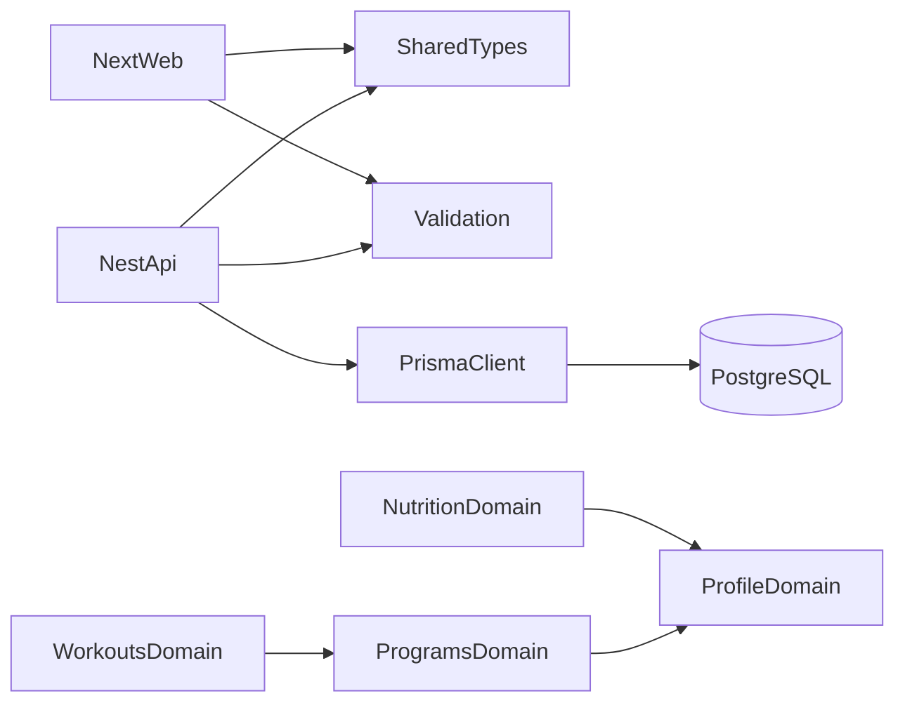

# Architecture

YS Fitness is a pnpm/Turborepo monorepo with a NestJS REST API, a Next.js web app, PostgreSQL through Prisma, and shared contract packages.

## Domain boundaries

Questionnaire input, derived targets, and generated plans are separate domain concerns:

- **Profile data** records facts supplied by the user: name, date of birth, calculation sex, height, activity level, goal, restrictions, and measurement history. Name is optional on older profiles and required for new onboarding saves. After onboarding, `PATCH /users/me/profile` may update height, append a weight measurement, and write experience, design goal, and training frequency on `OnboardingResponses`. It does not change name, date of birth, program track, or calculation sex.
- **Questionnaire input** is stored on `OnboardingResponses`, one row per user, separate from `UserProfile`. It holds the raw quiz (`programTrack`, body photos, physique level, design goal, experience, frequency, focus areas, nutrition habits). Nutrition and programs may read it later; they must not write it. The users module writes it on onboarding submit and on profile PATCH.
- **Nutrition** calculates and stores versioned calorie and macro targets from profile data. It must not add calculated values to `UserProfile`.
- **Programs** assigns one of the trainer's existing templates from onboarding answers. It does not algorithmically generate a program. A `WorkoutProgram` stores only the user and the template id, so a later template edit is what assigned clients see. It does not copy days into the profile or invent a program when no template matches. `ProgramTemplate.name` is the CSV subtitle, not a marketing title invented in code. A template row may allow an optional abs exercise. That hint is display-only: choosing it is not logged, and no history or progression is stored for it. `ExerciseSeedCheck` runs once at API startup. It refuses to boot when there are no exercises or no active templates, and when any exercise still at the migration placeholder of 12–12 is used by an active template. Rows on a retired template do not affect the check. Abs add-on flags stay display data and are not a seed signal. `db:migrate` and `db:seed` are one deployment step: the reps migration writes those placeholders, and the seed replaces them. Profile PATCH reassigns or unassigns only through `ProgramsService` in the same transaction as the profile writes; users code does not touch `workout_programs` directly. Male track still has no templates, so match stays empty.
- **Workouts** records a completed program day on `WorkoutLog` and the sets actually performed on `WorkoutLogSet` (`templateId`, `dayNumber`, and `exerciseId` are stored as they were at log time). The dashboard shows the next day by rotating forward from the latest log for the assigned template, wrapping after `frequencyPerWeek`, and `programProgress` counts logs for that template since `assignedAt` against `frequencyPerWeek × 8`. Weight-progression suggestions, a calendar view, and a page that lists every program day are separate future tasks.

Web onboarding asks program track (female/male visual branch) once. That choice writes `programTrack` on `OnboardingResponses` and also fills `biologicalSexForCalculation` on the persisted profile. See [ADR 003](docs/adr/003-onboarding-program-track-and-bmr-sex.md).

Users who completed onboarding before `OnboardingResponses` existed have no row. `GET /users/me/onboarding-responses` returning `{ responses: null }` is expected for them. Do not backfill invented answers.

A domain may read another domain through an explicit service or public contract. It must not mutate another domain's tables directly. New calculated outputs should retain enough input/version metadata to explain when and how they were produced.

## Backend modules

NestJS modules own their HTTP endpoints, domain logic, and data access. Controllers remain thin. Zod request schemas originate in `@repo/validation`; public response shapes originate in `@repo/shared-types`. Prisma-generated types stay inside `apps/api`.

Prisma access belongs in a domain service for simple modules or a repository when queries become nontrivial or need focused unit testing. Controllers never inject `PrismaService`.

See [CONTRIBUTING.md](CONTRIBUTING.md) for the standard module tree.

## Authentication sessions

Every login creates an `AuthSession`. Access JWTs contain only identity and authorization claims: `sub`, `sessionId`, `role`, `iat`, and `exp`.

Refresh JWTs are one-time credentials. The API stores only their SHA-256 digests in `AuthRefreshToken` records:

1. A valid refresh consumes the current token record.
2. A replacement token is issued in the same transaction.
3. Presenting a consumed token proves that a credential has been copied or replayed.
4. The whole session and its token family are revoked because the server cannot identify which holder is legitimate.

Password hashing uses Argon2. Refresh-token digests use SHA-256 because refresh tokens already have high cryptographic entropy and require indexed lookup.

Browser refresh tokens use HttpOnly cookies with origin checks and SameSite protection. `SameSite=None` additionally requires a signed double-submit CSRF token. Native clients receive refresh tokens in the response body for secure device storage.

Decision details are recorded in [ADR 001](docs/adr/001-refresh-token-rotation.md).

## Shared package boundaries

### `@repo/shared-types`

Contains public API request/response/error contracts used across applications. It must never export:

- Prisma models, generated enums, or `Prisma.Decimal`
- database-only fields such as password or token hashes
- internal persistence shapes

API services map persistence results into these contracts at the boundary.

### `@repo/validation`

Contains reusable Zod schemas and their inferred input types. The API uses them for runtime request validation; web/mobile use the same schemas for forms. Domain-only invariants that require database state remain in domain services.

Zod is the only request-validation strategy. Do not introduce `class-validator`. See [ADR 002](docs/adr/002-zod-validation.md).

### `@repo/ui`

Contains cross-application visual primitives only. Web-specific compositions remain in `apps/web`.

## Dependency direction

```mermaid
flowchart LR
  Web[NextWeb] --> SharedTypes[SharedTypes]
  Web --> Validation[Validation]
  Api[NestApi] --> SharedTypes
  Api --> Validation
  Api --> Prisma[PrismaClient]
  Prisma --> Database[(PostgreSQL)]
  Nutrition[NutritionDomain] --> Profiles[ProfileDomain]
  Programs[ProgramsDomain] --> Profiles
  Workouts[WorkoutsDomain] --> Programs
```

Shared packages do not depend on applications or Prisma. Domain modules do not import controllers from other domains.

## Subscriptions

The subscriptions module owns `plans` and `subscriptions`. Checkout talks to a `PAYMENT_PROVIDER` token; the current implementation is `MockPaymentProvider` (instant confirmation, no hosted page). Trainer/admin grants write `MANUAL` subscriptions and never call the provider. PostgreSQL enforces at most one `PENDING` or `ACTIVE` row per user with a partial unique index; the service `findFirst` is a fast path, not the lock. `GET /subscriptions/me` returns `{ subscription }` so a missing row is JSON `null` rather than an empty Nest body.

The partial unique index `subscription_one_active_per_user` is hand-written in the `add_plans_and_subscriptions` migration because Prisma cannot model it (a comment on the `Subscription` model in `schema.prisma` points to it), so `prisma db push` and schema-only rebuilds drop it; `SubscriptionIndexCheck` queries `pg_indexes` at bootstrap and refuses to start without it. Because the index is keyed on status, lapsed subscriptions are expired lazily: every read of the current subscription (`GET /subscriptions/me`, `SubscriptionGuard`, checkout, renew, and grant conflict checks) first flips `ACTIVE` rows whose `currentPeriodEnd` has passed to `EXPIRED`. `currentPeriodEnd` must always be set when a row becomes `ACTIVE`: a null value is never expired, so the row keeps blocking new checkouts and grants, yet `SubscriptionGuard` denies access for it. A lifetime or open-ended manual grant therefore needs an explicit far-future date, not null.

Checkout and renew reserve `pendingPlanId` before calling the provider, then activate or extend in a following transaction when the mock confirms immediately. If the provider call fails after the reserve, a `PENDING` (or `ACTIVE` with `pendingPlanId`) row can remain so a retry continues that slot instead of inserting a second subscription. Grants still run in a single transaction, so a grant failure leaves no orphaned row. `MockPaymentProvider` is registered through a factory that throws when `NODE_ENV=production`. Delayed hosted checkout, return URLs, and payment webhooks are out of scope until a real provider is chosen.

## Architecture changes

Changes to module ownership, cross-domain data flow, authentication trust boundaries, or shared-package responsibilities require an ADR and corresponding updates to this document.
